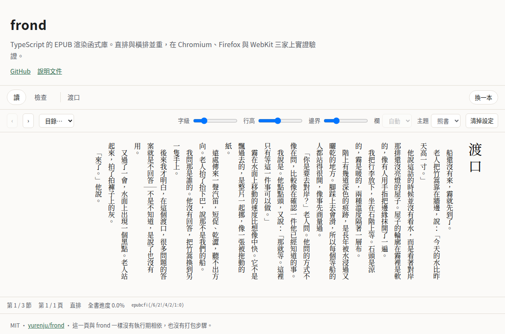
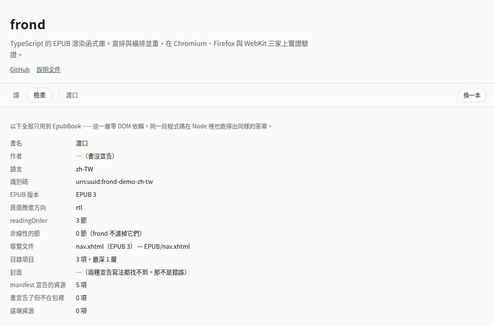

# frond

A TypeScript EPUB rendering library. Vertical and horizontal writing are equal
citizens, and every layout claim is verified on Chromium, Firefox and WebKit.

[繁體中文](README.zh-TW.md)



**[Try it with your own EPUB →](https://yurenju.github.io/frond/)** Drag a file
in and read it, or switch to the inspect panel and see exactly what frond reads
out of your book. It runs entirely in the page — frond has no download or upload
code path at all.

## Status: 0.x, and the API will change

frond is not on npm, and that is deliberate. Publishing implies a promise about
semver and API stability that a library this young cannot keep. Install it as a
git dependency pinned to a tag; npm comes later, once the API has held still
(see [ADR-0008](docs/adr/0008-distribution-and-license.md)).

```bash
npm install github:yurenju/frond#v0.1.0
```

The package builds itself on install, using its own pinned TypeScript — you do
not need TypeScript in your project. What you get is plain ES modules plus
`.d.ts` files.

## Zero runtime dependencies

frond ships no dependencies. Not "few" — none. ZIP reading, XML parsing, CFI and
pagination are all its own code, on top of platform APIs (`DecompressionStream`,
`DOMParser`, blob URLs, `ResizeObserver`).

One consequence is worth stating plainly: **the emitted modules contain no bare
specifiers, so a browser can import them directly.** No bundler, no build step,
no import map.

```html
<div id="viewer" style="height: 100dvh"></div>

<script type="module">
  import { EpubBook } from "./frond/epub/index.js";
  import { Renderer } from "./frond/renderer/index.js";

  const book = await EpubBook.open(await file.arrayBuffer());
  const renderer = await Renderer.attach(book, document.getElementById("viewer"), {
    settings: { fontSize: 20, margin: 32 },
    on: {
      relocate: (at) => console.log(at.page + 1, "of", at.pageCount, at.cfi),
    },
  });

  await renderer.next();
</script>
```

The demo site is the full version of that snippet — see
[`site/app.js`](site/app.js). It is not an example that sits in a folder rotting;
it is deployed on every push to `main`.

## Two layers

frond is split in two, and you can use either half on its own.

| Entry point | Needs DOM | What it gives you |
| --- | --- | --- |
| `frond/epub` | no | `EpubBook.open(bytes)` → metadata, reading order, TOC, cover, manifest resources, raw bytes by path. Plus CFI parsing, serialising and comparison. |
| `frond/renderer` | yes | `Renderer.attach(book, element)` → paging, section navigation, reader settings, writing mode, CFI ↔ position, typed events. |

`EpubBook` has no DOM dependency at all, so it runs in Node — parsing tests do
not need a browser. The inspect panel on the demo site is built out of that half
alone:



`Renderer` does not take an `EpubBook`; it takes a narrow `RenderableBook`
interface that `EpubBook` happens to satisfy. `MemoryBook`, an in-memory
implementation of that interface, is part of the public API on purpose: when you
test the code that reacts to frond's events, you should not have to fake a book
yourself.

Events are a typed emitter, not DOM `CustomEvent`:

```ts
const stop = renderer.on("relocate", (at) => {
  //                                   ^? RenderLocation, not any
  progress.value = at.fraction ?? 0;
});
```

## What frond does not do

This list is the honest part of the README. Most of these are decisions, not
gaps.

- **It does not handle gestures.** `next()` and `previous()` are actions, not
  event handlers. Whether swiping left means forward depends on the book's page
  progression direction and on your product; frond reports the fact and you make
  the call.
- **It does not fetch anything.** `EpubBook.open()` takes bytes. Remote
  resources declared inside a book are reported as remote and left alone.
- **It does not follow links.** Clicking a link inside the book emits an event
  saying where it points. Navigating is your decision.
- **It does not report a page count for the book.** A page is a product of the
  viewport and the reader's font size, not a property of the book. frond reports
  pages within the current section, and a 0–1 fraction for whole-book position.
- **It does not run scripts inside books.** `<script>` elements and `on*`
  attributes are stripped before a section is ever parsed into a document. EPUB 3
  permits scripted content; frond declines it as a security decision, not as a
  missing feature ([ADR-0006](docs/adr/0006-iframe-isolation-no-scripted-content.md)).
- **It does not do DRM**, and it will not.
- **It does not manage a library.** Shelves, collections and sync are yours.
- **It is EPUB only.** No MOBI, FB2, CBZ or PDF. That is why `EpubBook` is a
  concrete type instead of an abstraction over formats.

## Support boundary

EPUB 3 and EPUB 2 are both supported, and frond does not branch on version where
the real world does not: covers declared the EPUB 2 way are found in EPUB 3
books too, because that is what shipping books actually look like.

Where a book says nothing, frond reports "the book did not say" rather than
substituting a default. EPUB 2 has no page progression direction, so
`metadata.pageProgressionDirection` is `undefined` for every EPUB 2 book — that
is different from a book that declared `ltr`, and the difference is yours to
act on. Details in [ADR-0010](docs/adr/0010-epub-2-support-boundary.md).

Not supported in the archive layer: ZIP64, encrypted entries, and compression
methods other than stored and deflate. Across a 34-book sample of commercial
Chinese-language EPUBs (3309 entries) none of these appeared.

## Browsers

Chromium, Firefox and WebKit are tested as equals — a failure in any one of them
is a failure. There is no tier list, because the writing mode this library cares
most about is the one where engines disagree most. Measured differences are
logged in [`docs/browser-quirks.md`](docs/browser-quirks.md).

## Development

Every command goes through `npm run`; the scripts pin the versions and flags.

```bash
npm run typecheck       # tsc --noEmit over src, scripts and tests
npm run test:node       # Vitest — the parsing layer, no browser
npm run test:container  # both runners inside the test image (browsers live there)
npm run build           # emit dist/
npm run site            # build dist/ and assemble the demo site
```

Browser tests only run inside the container: the three engines and the pinned
fonts exist in the test image, not on your machine. See
[`AGENTS.md`](AGENTS.md).

## Licence

MIT. See [LICENSE](LICENSE).

frond is a reimplementation, not a port, and ships no third-party code. The one
piece of upstream material in this repository is the CFI acceptance table in
`tests/node/cfi/foliate-acceptance.test.ts`, taken from
[foliate-js](https://github.com/johnfactotum/foliate-js) (MIT, Copyright (c)
2022 John Factotum). See [THIRD-PARTY-NOTICES.md](THIRD-PARTY-NOTICES.md).
