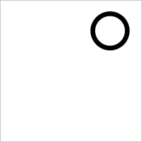

# 瀏覽器 quirks

逐條登記三家瀏覽器的行為差異：症狀、繞法、frond 是否需要處理、哪個測試會抓到。

這份表是「以 foliate 為參考實作」的實體產出物——搬運的是知識而非程式碼（ADR-0001）。重新實作不會繼承 foliate 已經套好的補丁，只會重新撞上一次，所以每撞到一條就登記一條。最後一欄直接構成測試套件的需求清單。

登記的門檻是**實測**。從別人的原始碼或文件推得的行為要標明未經本專案驗證，不要與量測結果混在一起。

---

## WebKit 在直排下不自動套用 `vert`

**症狀**

`writing-mode: vertical-rl` 下，CJK 標點沒有換成直排字符。日文句點應該移到字面方框的右上，實測 WebKit 把它留在左下。

以 `。`（U+3002，Noto Serif CJK JP，200px 方框，墨水重心正規化到 [0, 1]）量測：

| 瀏覽器 | 橫排 | 直排（預設） | 直排 + `font-feature-settings: "vert" 1` |
| --- | --- | --- | --- |
| Chromium | (0.180, 0.863) | **(0.780, 0.210)** 右上 | (0.780, 0.210) |
| Firefox | (0.181, 0.865) | **(0.778, 0.210)** 右上 | (0.778, 0.210) |
| WebKit | (0.181, 0.865) | **(0.251, 0.887)** 左下 | **(0.848, 0.330)** 右上 |

WebKit 預設的直排渲染除了位置不對，墨水像素數也較少（752 對 1086）——從圖上看得出原因：**句點被字面方框的下緣裁掉了**。取到的不只是位置不同，而是不同的字符。

`。`（Noto Serif CJK JP，200px 方框，灰框為方框邊界）：

| | Chromium | Firefox | WebKit |
| --- | --- | --- | --- |
| 直排（預設） |  |  |  |
| 直排 + `"vert" 1` |  |  |  |

橫排三家一致，都在左下，作為對照：

圖以 `docs/evidence/3/` 保存。產生方式：`tests/browser/support/glyph.ts` 的同一組參數，加上 1px 邊框以顯示方框邊界。

**繞法**

顯式 `font-feature-settings: "vert" 1`。實測強制之後 WebKit 移到右上，且 Chromium 與 Firefox 的結果不受影響——三家可以共用同一條規則，不需要分支。

**frond 是否需要處理**

需要。直排是 frond 的硬需求，標點位置錯誤是讀者一眼看得到的缺陷，而 DOM 斷言與幾何不變量都抓不到——全形標點的字面寬相同，斷行與斷頁完全不受影響。

尚未決定的是**注入的層級**：是 Renderer 一律注入，還是只在 WebKit 注入。一律注入比較簡單且已驗證無害，但那是 frond 主動覆寫書的宣告，需要對照 ADR-0003 的介入門檻——這一條應該歸類為「內容讀不到」還是根本不算介入，值得寫進封閉清單時想清楚。

**哪個測試會抓到**

`tests/browser/smoke/vertical-writing.spec.ts` 的「標點取到直排字符」。目前該測試自行注入 `"vert" 1`，因此驗證的是「字型有直排字符且畫得出來」這個環境性質。等 Renderer 存在之後，需要另一條測試驗證 Renderer 本身有做這件事。

**環境**

`Dockerfile` 的映像（`mcr.microsoft.com/playwright:v1.61.1-noble`、`fonts-noto-cjk` `1:20230817+repack1-3`）。Playwright 的 WebKit 是 Linux 上的建置，文字塑形走 HarfBuzz + Fontconfig，真 Safari 走 CoreText——**這條在 iOS 上的行為未經驗證**（ADR-0004 明列不做 iOS 驗證）。

---

## 三家對 generic family 的 CJK 解析不一致

**症狀**

書宣告 `font-family: serif`，三家瀏覽器對 CJK 字元各挑各的字面。fontconfig 的綁定（`docker/fontconfig/75-frond-cjk.conf`）在容器內的 `fc-match` 上完全正確，三家的分歧發生在**送進 fontconfig 之前**：各家決定「拿什麼去問」的方式不同。

以 `。`（U+3002）量測 `font-family: serif` 實際落到的字面（容器 locale `C.UTF-8`，每次量測用全新的 page）：

| 瀏覽器 | `lang=ja` | `lang=zh-TW` | 正確？ |
| --- | --- | --- | --- |
| Firefox | Noto Serif CJK JP | Noto Serif CJK TC | ✓ |
| WebKit | Noto Serif CJK **TC** | Noto Serif CJK TC | `lang=ja` 錯 |
| Chromium | Noto **Sans** CJK JP | Noto **Sans** CJK TC | 區域對、serif 錯 |

**各家的機制**（以下每一條都由介入實驗確認，不是從原始碼推的）

*Firefox*：拿文件的 `lang` 去問 fontconfig 要 `serif`，等同 `fc-match serif:lang=ja`。綁定完全生效。文件沒有 `lang` 時才落到行程 locale 的預設。

*WebKit*：有問 fontconfig 要 `serif`（證據：`serif` 底下的拉丁字母畫出來的是 Noto Serif CJK 的拉丁字符，也就是本專案綁定的結果，不是基底映像的 Liberation Serif），**但不帶文件的 `lang`**。缺的那格由 fontconfig 用行程的 locale 補上，於是整個行程共用一個區域字面。證據是把容器的 `LANG` 換成 `ja_JP.UTF-8`：WebKit 的 `serif` 從頭到尾變成 JP，連 `lang=zh-TW` 的文件也是。`C.UTF-8` 落在本專案綁定的通則，所以看起來像「一律選 TC」。

*Chromium*：**根本沒問 fontconfig 要 `serif`。** generic family 是 Blink 自己的字型偏好，headless 的預設值是 `Times New Roman` / `Arial`。證據是掛一份只改寫 `Times New Roman`（`qual="first"`，不動 `serif`）的 fontconfig 設定進去：Chromium 的 `serif` 立刻跟著改，而同一份設定裡針對 `lang=ja` 的那條規則沒有生效——所以它問的是 `Times New Roman` 而且不帶文件的 `lang`。`Times New Roman` 解析到 Liberation Serif，沒有 CJK 字符，CJK 字元接著走逐字元 fallback，落到 fontconfig 對該碼位的最佳字面 Noto **Sans** CJK。

也就是說 Chromium 的 `serif` 是兩段式的：**主字型 Liberation Serif 決定行高與基線，CJK 字符由另一套字型補上**。書宣告 serif，CJK 畫出來是黑體。

**繞法**

沒有。三家的分歧都發生在 CSS 管不到的層級：

- WebKit 的 `lang` 從來沒進到查詢裡，任何 fontconfig 設定都補不回來。唯一能動的是行程 locale，而那是一個全域值——沒辦法讓同一個行程裡的日文書與中文書各拿各的字面。
- Chromium 的 generic family 由瀏覽器偏好決定，網頁改不了；把 fontconfig 的 `Times New Roman` 綁到 CJK serif 可以救回 serif／sans 這一軸，但區域字面那一軸救不回來（該查詢同樣不帶 `lang`），而且那是拿一個特定瀏覽器版本的內部預設值當設定介面用。

唯一能讓三家一致的做法是**指名字面**——而那在 frond 裡屬於讀者設定，見下。

**frond 是否需要處理**

不需要，而且**不可以**。對照 ADR-0003 的介入門檻：介入只有兩個理由，內容讀不到、或讀者設定被書擋住。這裡兩個都不成立——每個字都在，只是字面不是最合適的那一個，屬於「書醜」。

**「三家渲染不一致」本身不是介入理由**：不一致的是平台的字型解析，不是書的宣告有問題，也不是 frond 有 bug。為了讓自己的差分測試好比對而改寫書的宣告，是把測試工具的需求偷渡成產品行為——那正是 ADR-0003 明確從 spine 移出來的 `rewriteGenericFonts`。

代價要明講：**跨瀏覽器自我差分（ADR-0004）在「書用 generic family 且讀者沒設字型」的情況下不成立**。此時三家會因為挑到不同字面而斷行不同、斷頁不同，比出來的差異與 frond 的程式碼無關。所以差分的 oracle 有一個前提條件：**跑差分時必須由讀者設定指名字面**。讀者設定本來就贏過書的宣告，這條路不需要任何新的介入項目；ADR-0003 已經要求 frond 提供字型覆寫面，這裡只是說明那個 API 同時是差分測試的前提。

**哪個測試會抓到**

`tests/browser/smoke/regional-faces.spec.ts` 的「generic family 依 lang 的解析」。它不再期待三家一致，改成把每一家的實際落點釘住——分歧是這個環境的性質，它變了要有人知道。已驗證有牙齒：把容器的 `LANG` 換成 `ja_JP.UTF-8`，WebKit 那兩條立刻紅。

`Dockerfile` 因此顯式釘死 `LANG` / `LC_ALL`（今天與基底映像相同，是 no-op），理由是這個變數實際上是字型設定的一部分。

**環境**

`Dockerfile` 的映像（`mcr.microsoft.com/playwright:v1.61.1-noble`、`fonts-noto-cjk` `1:20230817+repack1-3`）。三家瀏覽器都是 Linux 建置，走 HarfBuzz + Fontconfig。**真 Safari 走 CoreText，這一條在 iOS 上的行為未經驗證**（ADR-0004 明列不做 iOS 驗證）；Windows 與 macOS 上的 Chromium / Firefox 也沒有 fontconfig，落點必然不同，同樣未驗證。

**還沒查到的**

「為什麼 Blink 的 headless 預設就是 `Times New Roman`」「WebKit 是在哪一層丟掉 `lang` 的」這兩件事只有行為證據，沒有原始碼佐證——本機的出口白名單連不到 `source.chromium.org` 與 WebKit 的原始碼瀏覽器。要補的話從 Blink 的 `web_preferences` 與 WebKit 的 `FontCacheFreeType` 下手。

---

## Chromium 的字元 fallback 是一頁一次的

**症狀**

某個碼位第一次需要 fallback 時解析出來的字面，會被**那一頁**記住，之後同一頁裡的文件即使宣告不同的 `lang`，也拿到同一個字面。快取以碼位為單位，不看 `lang`。

這不是實驗室裡的細節：frond 一個 Section 一個 iframe、整本書共用一頁，所以**先渲染的 Section 決定後面所有 Section 的區域字面**。同一頁放兩個 iframe，各自宣告 `serif` 與自己的 `lang`：

| 順序 | Chromium | Firefox | WebKit |
| --- | --- | --- | --- |
| `ja` 先 | 兩個都 JP | 各自正確 | 兩個都 TC |
| `zh-TW` 先 | 兩個都 TC | 各自正確 | 兩個都 TC |

Chromium 那一欄的意思是：**同一份 `lang=zh-TW` 的內容，只因為排在一份日文內容後面，字面就變了。** WebKit 兩欄相同是另一個原因——它從頭到尾沒看 `lang`。

同一頁內換頁（`setContent`）不會清掉快取，開新的 page 會。

**繞法**

量測時一次一個全新的 page（`screenshotGlyphInIsolation`）。這是測試方法上的繞法，不是產品上的——真書渲染時 frond 沒辦法一個 Section 開一個 page。

**frond 是否需要處理**

這一條只在「書用 generic family」時才碰得到，因為指名字面根本不會走 fallback。所以處置與上一條相同：不介入，差分測試靠讀者設定指名字面。但登記在這裡，因為它會讓上一條的量測結果看起來像另一回事——共用一個 page 連續量好幾個 `lang`，量到的全是第一個 `lang` 的答案，於是很容易得出「Chromium 完全不理會 `lang`」這個錯誤結論。

**哪個測試會抓到**

`tests/browser/smoke/regional-faces.spec.ts` 的「同一頁的兩個 iframe 是否各自依 lang 解析」。三家的簽名互不相同，一條測試分得出來是誰變了。

---

## 量測方法：漢字不能用來鑑別字面

**症狀**

「骨」「直」這類漢字統一的代表字，其區域字形由 `lang` 經 OpenType `locl` 驅動——**同一字面換 `lang` 會變，不同字面同一 `lang` 不變**（三家一致）。拿漢字問「解析到哪個字面」永遠得到「看不出來」，而測試會在字型綁定完全失效的環境下照樣變綠。

標點才有鑑別力。`。` 分得出 TC／HK 與 JP／SC／KR，`：` 分得出 SC 與其餘；兩者合起來足以區分 TC／SC／JP。TC 與 HK、JP 與 KR 目前沒有找到分得開的字——需要用到那兩組時要另外找。

**哪個測試會抓到**

`tests/browser/smoke/regional-faces.spec.ts` 的「字形選擇的兩條路徑」。那一組把這兩條性質本身釘成測試，因為它們是同檔案裡其他斷言能夠成立的前提。
