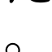
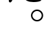
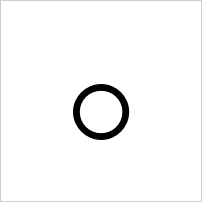
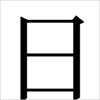
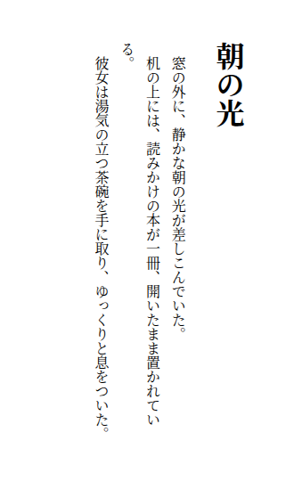
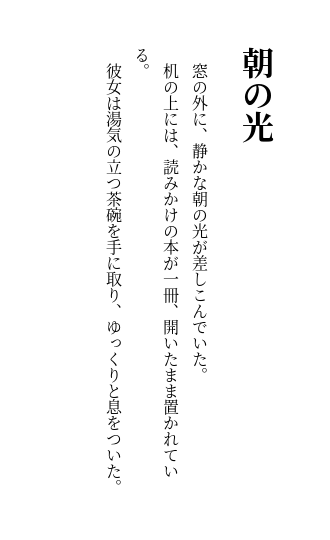
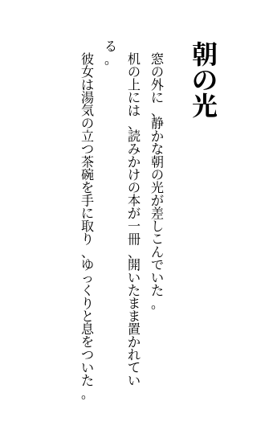

# 瀏覽器 quirks

逐條登記三家瀏覽器的行為差異：症狀、繞法、frond 是否需要處理、哪個測試會抓到。

這份表是「以 foliate 為參考實作」的實體產出物——搬運的是知識而非程式碼（ADR-0001）。重新實作不會繼承 foliate 已經套好的補丁，只會重新撞上一次，所以每撞到一條就登記一條。最後一欄直接構成測試套件的需求清單。

登記的門檻是**實測**。從別人的原始碼或文件推得的行為要標明未經本專案驗證，不要與量測結果混在一起。

---

## WebKit 在直排下不自動套用 `vert`

**症狀**

`writing-mode: vertical-rl` 下，CJK 標點沒有換成直排字符。日文句點應該移到字面方框的右上，實測 WebKit 把它留在左下。

以 `。`（U+3002，Noto Serif CJK JP，200px 方框，墨水重心正規化到 [0, 1]）量測：

| 瀏覽器 | 橫排 | 直排（預設） | 直排 + `font-feature-settings: "vert" 1` |
| --- | --- | --- | --- |
| Chromium | (0.180, 0.863) | **(0.780, 0.210)** 右上 | (0.780, 0.210) |
| Firefox | (0.181, 0.865) | **(0.778, 0.210)** 右上 | (0.778, 0.210) |
| WebKit | (0.181, 0.865) | **(0.251, 0.887)** 左下 | **(0.848, 0.330)** 右上 |

WebKit 預設的直排渲染除了位置不對，墨水像素數也較少（752 對 1086）——從圖上看得出原因：**句點被字面方框的下緣裁掉了**。取到的不只是位置不同，而是不同的字符。

`。`（Noto Serif CJK JP，200px 方框，灰框為方框邊界）：

| | Chromium | Firefox | WebKit |
| --- | --- | --- | --- |
| 直排（預設） |  |  |  |
| 直排 + `"vert" 1` |  |  |  |

橫排三家一致，都在左下，作為對照：

圖以 `docs/evidence/3/` 保存。產生方式：`tests/browser/support/glyph.ts` 的同一組參數，加上 1px 邊框以顯示方框邊界。

**繞法**

顯式 `font-feature-settings: "vert" 1`。實測強制之後 WebKit 移到右上，且 Chromium 與 Firefox 的結果不受影響——三家可以共用同一條規則，不需要分支。

**foliate 沒有補這一條**（#7 實測）

foliate-js 的 `paginator.js` 不注入任何 `font-feature-settings`，所以它在 WebKit 上照樣是錯的——這一格 frond 必須自己做，不能指望「照 foliate 抄就好」。

量法是**同一家瀏覽器內的對照**：把 `vertical-japanese.epub` 交給 foliate 渲染、讀者字級覆寫成 64px，截下第一個 `。` 的字面方框；再用同一組參數但額外加上 `font-feature-settings: "vert" 1` 跑一次，比對兩張圖的解碼像素。跨瀏覽器的絕對數字在這裡不可比（三家給的 range rect 寬度不同，WebKit 的還比字面方框高出 0.98px，裁進來的鄰字墨水量不一樣），可比的是同一家內的那兩張。

| 瀏覽器 | 預設 vs 強制 `"vert" 1` | 預設的墨水重心／像素 | 強制後 |
| --- | --- | --- | --- |
| Chromium | **逐位元組相同** | (0.768, 0.203) ／ 121 px | 同左 |
| Firefox | **逐位元組相同** | (0.770, 0.203) ／ 125 px | 同左 |
| WebKit | **不同** | (0.447, 0.447) ／ 157 px | (0.765, 0.224) ／ 196 px |

| | WebKit 預設 | WebKit 強制 `"vert" 1` | 對照：Chromium 預設 |
| --- | --- | --- | --- |
| foliate 渲染的 `。`（64px） |  |  |  |

**frond 是否需要處理**

需要。直排是 frond 的硬需求，標點位置錯誤是讀者一眼看得到的缺陷，而 DOM 斷言與幾何不變量都抓不到——全形標點的字面寬相同，斷行與斷頁完全不受影響。

尚未決定的是**注入的層級**：是 Renderer 一律注入，還是只在 WebKit 注入。一律注入比較簡單且已驗證無害，但那是 frond 主動覆寫書的宣告，需要對照 ADR-0003 的介入門檻——這一條應該歸類為「內容讀不到」還是根本不算介入，值得寫進封閉清單時想清楚。

**哪個測試會抓到**

`tests/browser/smoke/vertical-writing.spec.ts` 的「標點取到直排字符」。目前該測試自行注入 `"vert" 1`，因此驗證的是「字型有直排字符且畫得出來」這個環境性質。等 Renderer 存在之後，需要另一條測試驗證 Renderer 本身有做這件事。

**環境**

`Dockerfile` 的映像（`mcr.microsoft.com/playwright:v1.61.1-noble`、`fonts-noto-cjk` `1:20230817+repack1-3`）。Playwright 的 WebKit 是 Linux 上的建置，文字塑形走 HarfBuzz + Fontconfig，真 Safari 走 CoreText——**這條在 iOS 上的行為未經驗證**（ADR-0004 明列不做 iOS 驗證）。

---

## 三家對 generic family 的 CJK 解析不一致

**症狀**

書宣告 `font-family: serif` 或 `sans-serif`，三家瀏覽器對 CJK 字元各挑各的字面。fontconfig 的綁定（`docker/fontconfig/75-frond-cjk.conf`）在容器內的 `fc-match` 上完全正確，三家的分歧發生在**送進 fontconfig 之前**：各家決定「拿什麼去問」的方式不同。

以 `。`（U+3002）量測實際落到的字面（容器 locale `C.UTF-8`，每次量測用全新的 page）：

| 宣告 | 瀏覽器 | `lang=ja` | `lang=zh-TW` | 與另外兩家一致？ |
| --- | --- | --- | --- | --- |
| `serif` | Firefox | Noto Serif CJK JP | Noto Serif CJK TC | 這一家是對的 |
| `serif` | WebKit | Noto Serif CJK **TC** | Noto Serif CJK TC | `lang=ja` 拿到 TC |
| `serif` | Chromium | Noto **Sans** CJK JP | Noto **Sans** CJK TC | 區域對，但畫出來是黑體 |
| `sans-serif` | Firefox | Noto Sans CJK JP | Noto Sans CJK TC | 這一家是對的 |
| `sans-serif` | WebKit | Noto Sans CJK **TC** | Noto Sans CJK TC | `lang=ja` 拿到 TC |
| `sans-serif` | Chromium | Noto Sans CJK JP | Noto Sans CJK TC | 字面對，但主字型是拉丁字型 |

`sans-serif` 那三列說明分歧不會因為換一個 generic family 就消失：Chromium 的 `sans-serif` 剛好挑到正確的區域字面，但**主字型仍然是 Liberation Sans**——行高與基線由拉丁字型決定，斷行與另外兩家不同。三家一致的只有指名字面的情況。

**看得到的樣子**

書宣告 `serif`、`lang="ja"`，句點（唯一有鑑別力的字）落在哪：

| | Chromium | Firefox | WebKit |
| --- | --- | --- | --- |
| 書宣告 `serif` |  |  |  |
| 對照：指名 `Noto Serif CJK JP` |  |  |  |

JP 字面的句點在左下，TC 字面置中。**只有 Firefox 的兩格相同**——它的 `serif` 解析到了 JP。WebKit 的第一格置中，是 TC。逐位元組比對：Firefox 的 `serif+ja` 與指名 JP 截圖 hash 相同，Chromium 與 WebKit 都不同。

明體／黑體那一軸換漢字看（漢字鑑別不了字面，但看得出筆畫）：

| | Chromium | Firefox | WebKit |
| --- | --- | --- | --- |
| 書宣告 `serif` |  |  |  |

Chromium 的 `日` 沒有起筆收筆——書要的是明體，畫出來是黑體。

圖以 `docs/evidence/4/` 保存。產生方式：`tests/browser/support/glyph.ts` 的同一組參數（單字元、200px 方框、每次量測用全新的 page），加上 1px 邊框以顯示方框邊界。**不要換成看起來比較有說服力的字串**：漢字的區域字形由 `lang` 驅動，樣本裡混進漢字會讓 WebKit 的 `serif+ja` 與指名 JP 的截圖變得逐位元組相同，看起來像 WebKit 是對的。

**各家的機制**（以下每一條都由介入實驗確認，不是從原始碼推的）

*Firefox*：拿文件的 `lang` 去問 fontconfig 要 generic family，等同 `fc-match serif:lang=ja`。綁定完全生效。文件沒有 `lang` 時才落到行程 locale 的預設。

*WebKit*：有問 fontconfig 要 generic family（證據：`serif` 底下的拉丁字母畫出來的是 Noto Serif CJK 的拉丁字符，也就是本專案綁定的結果，不是基底映像的 Liberation Serif），**但不帶文件的 `lang`**。缺的那格由 fontconfig 用行程的 locale 補上，於是整個行程共用一個區域字面。證據是把容器的 `LANG` 換成 `ja_JP.UTF-8`：WebKit 的 `serif` 從頭到尾變成 JP，連 `lang=zh-TW` 的文件也是。`C.UTF-8` 落在本專案綁定的通則，所以看起來像「一律選 TC」。

*Chromium*：**根本沒問 fontconfig 要 generic family。** 它問的是一個具名的拉丁字型——`serif` 問的是 `Times New Roman`。證據是掛一份只改寫 `Times New Roman`（`qual="first"`，不動 `serif`）的 fontconfig 設定進去：Chromium 的 `serif` 立刻跟著改，而同一份設定裡針對 `lang=ja` 的那條規則沒有生效——所以它問的是 `Times New Roman` 而且不帶文件的 `lang`。該名稱解析到 Liberation Serif，沒有 CJK 字符，CJK 字元接著走逐字元 fallback，落到 fontconfig 對該碼位的最佳字面 Noto **Sans** CJK。

`sans-serif` 走同一條路，只是問的名字不同：拉丁字母落在 Liberation Sans 上，而 `fc-match Arial` 正是 Liberation Sans。**「那個名字就是 `Arial`」這一格沒有做介入實驗，是從落點推的**，與 `serif` 那條的證據強度不同。

也就是說 Chromium 的 generic family 是兩段式的：**主字型（Liberation Serif／Sans）決定行高與基線，CJK 字符由另一套字型補上**。書宣告 serif，CJK 畫出來是黑體。

**繞法**

沒有。三家的分歧都發生在 CSS 管不到的層級：

- WebKit 的 `lang` 從來沒進到查詢裡，任何 fontconfig 設定都補不回來。唯一能動的是行程 locale，而那是一個全域值——沒辦法讓同一個行程裡的日文書與中文書各拿各的字面。
- Chromium 的 generic family 由瀏覽器偏好決定，網頁改不了；把 fontconfig 的 `Times New Roman` 綁到 CJK serif 可以救回 serif／sans 這一軸，但區域字面那一軸救不回來（該查詢同樣不帶 `lang`），而且那是拿一個特定瀏覽器版本的內部預設值當設定介面用。

唯一能讓三家一致的做法是**指名字面**——而那在 frond 裡屬於讀者設定，見下。

**frond 是否需要處理**

不需要，而且**不可以**。對照 ADR-0003 的介入門檻：介入只有兩個理由，內容讀不到、或讀者設定被書擋住。這裡兩個都不成立——每個字都在，只是字面不是最合適的那一個，屬於「書醜」。

**「三家渲染不一致」本身不是介入理由**：不一致的是平台的字型解析，不是書的宣告有問題，也不是 frond 有 bug。為了讓自己的差分測試好比對而改寫書的宣告，是把測試工具的需求偷渡成產品行為——那正是 ADR-0003 明確從 spine 移出來的 `rewriteGenericFonts`。

代價要明講：**跨瀏覽器自我差分（ADR-0004）在「書用 generic family 且讀者沒設字型」的情況下不成立**。此時三家會因為挑到不同字面而斷行不同、斷頁不同，比出來的差異與 frond 的程式碼無關。所以差分的 oracle 有一個前提條件：**跑差分時必須由讀者設定指名字面**。讀者設定本來就贏過書的宣告，這條路不需要任何新的介入項目；ADR-0003 已經要求 frond 提供字型覆寫面，這裡只是說明那個 API 同時是差分測試的前提。

> **ADR-0004 已依本條的量測修訂。** 它原本要求測試環境「確保書的 `serif` / `sans-serif` 在測試中解析到它們」——三家裡有兩家做不到，且無法從環境端補救，該句已移除，改以「差分必須在讀者設定指名字面的前提下執行」取代。見 ADR-0004 的〈差分要成立，字面必須由讀者設定指名〉。

**哪個測試會抓到**

`tests/browser/smoke/regional-faces.spec.ts` 的「generic family 依 lang 的解析」，`serif` 與 `sans-serif` 各兩條。它不再期待三家一致，改成把每一家的實際落點釘住——分歧是這個環境的性質，它變了要有人知道。已驗證有牙齒：把容器的 `LANG` 換成 `ja_JP.UTF-8`，WebKit 那幾條立刻紅。

`Dockerfile` 因此顯式釘死 `LANG` / `LC_ALL`（今天與基底映像相同，是 no-op），理由是這個變數實際上是字型設定的一部分。

**環境**

`Dockerfile` 的映像（`mcr.microsoft.com/playwright:v1.61.1-noble`、`fonts-noto-cjk` `1:20230817+repack1-3`）。三家瀏覽器都是 Linux 建置，走 HarfBuzz + Fontconfig。**真 Safari 走 CoreText，這一條在 iOS 上的行為未經驗證**（ADR-0004 明列不做 iOS 驗證）；Windows 與 macOS 上的 Chromium / Firefox 也沒有 fontconfig，落點必然不同，同樣未驗證。

**還沒查到的**

「為什麼 Blink 的 headless 預設就是 `Times New Roman`」「WebKit 是在哪一層丟掉 `lang` 的」這兩件事只有行為證據，沒有原始碼佐證——本機的出口白名單連不到 `source.chromium.org` 與 WebKit 的原始碼瀏覽器。要補的話從 Blink 的 `web_preferences` 與 WebKit 的 `FontCacheFreeType` 下手。

---

## Chromium 的字元 fallback 是一頁一次的

**症狀**

某個碼位第一次需要 fallback 時解析出來的字面，會被**那一頁**記住，之後同一頁裡的文件即使宣告不同的 `lang`，也拿到同一個字面。快取以碼位為單位，不看 `lang`。

這不是實驗室裡的細節：frond 一個 Section 一個 iframe、整本書共用一頁，所以**先渲染的 Section 決定後面所有 Section 的區域字面**。同一頁放兩個 iframe，各自宣告 `serif` 與自己的 `lang`：

| 順序 | Chromium | Firefox | WebKit |
| --- | --- | --- | --- |
| `ja` 先 | 兩個都 JP | 各自正確 | 兩個都 TC |
| `zh-TW` 先 | 兩個都 TC | 各自正確 | 兩個都 TC |

Chromium 那一欄的意思是：**同一份 `lang=zh-TW` 的內容，只因為排在一份日文內容後面，字面就變了。** WebKit 兩欄相同是另一個原因——它從頭到尾沒看 `lang`。

同一頁內換頁（`setContent`）不會清掉快取，開新的 page 會。

**繞法**

量測時一次一個全新的 page（`screenshotGlyphInIsolation`）。這是測試方法上的繞法，不是產品上的——真書渲染時 frond 沒辦法一個 Section 開一個 page。

**frond 是否需要處理**

這一條只在「書用 generic family」時才碰得到，因為指名字面根本不會走 fallback。所以處置與上一條相同：不介入，差分測試靠讀者設定指名字面。但登記在這裡，因為它會讓上一條的量測結果看起來像另一回事——共用一個 page 連續量好幾個 `lang`，量到的全是第一個 `lang` 的答案，於是很容易得出「Chromium 完全不理會 `lang`」這個錯誤結論。

**哪個測試會抓到**

`tests/browser/smoke/regional-faces.spec.ts` 的「同一頁的兩個 iframe」。三家的簽名互不相同，一條測試分得出來是誰變了。該測試把兩個 iframe **先後**掛上去而不是一次寫進 `setContent`：主題就是「誰先渲染」，同時掛的話誰先跑完並不保證。

**環境**

`Dockerfile` 的映像（`mcr.microsoft.com/playwright:v1.61.1-noble`）。快取的存續範圍是實測的（同頁換文件仍在、開新 page 就沒了），沒有查過它在 Chromium 內部是掛在哪一層，所以**別的 Chromium 版本上範圍可能不同**。

---

## 量測方法：漢字不能用來鑑別字面

**症狀**

「骨」「直」這類漢字統一的代表字，其區域字形由 `lang` 經 OpenType `locl` 驅動——**同一字面換 `lang` 會變，不同字面同一 `lang` 不變**（三家一致）。拿漢字問「解析到哪個字面」永遠得到「看不出來」，而測試會在字型綁定完全失效的環境下照樣變綠。

**繞法**

用標點。實測 `。` 分得出 TC／HK 與 JP／SC／KR，`：` 分得出 SC 與其餘；兩者合起來足以區分 TC／SC／JP。TC 與 HK、JP 與 KR 目前沒有找到分得開的字——需要用到那兩組時要另外找。

**frond 是否需要處理**

不需要——這一條是量測方法，不是渲染行為。登記在這裡是因為它決定了本檔其餘每一條的可信度：用錯字量，整批結論會在綁定完全失效的環境下照樣看起來是綠的。

**哪個測試會抓到**

`tests/browser/smoke/regional-faces.spec.ts` 的「字形選擇的兩條路徑」。那一組把這兩條性質本身釘成測試，因為它們是同檔案裡其他斷言能夠成立的前提。

**環境**

`Dockerfile` 的映像（`fonts-noto-cjk` `1:20230817+repack1-3`）。哪些字分得開哪些字面是**這一版字型**的性質，換字型或換版本要重新量。

---

## foliate-js 的直排在 Firefox 沒有壞（#7 的答案）

這一條不是 quirk，是一個**被撤回的宣稱**。登記在這裡是因為它曾經被當成事實寫進規劃文件，而且被當成 frond 最大的技術風險。

**宣稱**：spine 的 `docs/research/epub-rendering-libraries.md` 記載「vertical writing 在 Firefox 上是壞的」，來源標為 foliate 的官方文件／README。ADR-0001 查過 foliate repo，查無實據，結論是「在核實前應視為未知」。#1 的 Further Notes 據此把「若屬實則是 frond 最主要的技術挑戰」寫進了工作排序。

**實測**：把 foliate-js（`78914ae`）放進 `Dockerfile` 的映像，用 `tests/fixtures/vertical-japanese.epub` 在三家各跑一次，800×600、`deviceScaleFactor` 1、書自己的樣式（不覆寫讀者設定）。

| 量到的東西 | Chromium 149.0.7827.0 | Firefox 151.0 | WebKit 26.5 |
| --- | --- | --- | --- |
| `documentElement` 的 `writing-mode` | `vertical-rl` | `vertical-rl` | `vertical-rl` |
| `column-width` | 466px | 466px | 466px |
| 頁長 `size` ／ 總長 `viewSize` | 504 ／ 1512 | 504 ／ 1512 | 504 ／ 1512 |
| 頁數（含 foliate 的 2 個補白頁） | 3 | 3 | 3 |
| 字元推進（下一個字相對前一個） | dx 0、**dy +32** | dx 0、**dy +32** | dx 0、**dy +32** |
| 行推進（下一區塊相對前一區塊） | dx **−46.3** | dx **−50.3** | dx **−46.8** |
| 起始 CFI | `epubcfi(/6/2!/4,/2,/8/1:27)` | 同左 | 同左 |
| 起始 fraction | 0.35532407407407407 | 同左 | 同左 |
| 翻到書末再翻回來 | 2 步到底，回程 CFI 與起點**相同** | 同左 | 同左 |
| `pageerror` | 無 | 無 | 無 |

字元往下、行往左，三家一致——那就是直排。位置與進度的數字三家逐位數相同。翻頁往返回得到原位。

**行推進那一列只有符號可以跨瀏覽器比，數值不行**，理由與 foliate 無關：三家對「單一字元的 range」回傳的矩形不是同一個框。同樣是 32px 的 `h1`，Chromium 與 WebKit 回 46px 寬（= 字型的 ascent + descent 決定的 inline 內容區，Noto Serif CJK 約 1.44 em），Firefox 回 32px（= 字面方框，1.0 em）；16px 的 `p` 對應 23px 與 16px，比例相同。量的框不一樣，起點自然差。**這一格是量測方法的陷阱**：拿單字元 range 的 `left` 去做跨瀏覽器差分，會得到一組與版面無關的差異。

| Chromium | Firefox | WebKit |
| --- | --- | --- |
|  |  |  |

**答案：沒有壞。** 三家都排得出直排、翻得動、回得去原位，而且**每一個會影響讀者的量都相同**：欄寬、頁數、頁長、位置、進度。表裡唯一有數值差異的那一列是量測方法造成的（見上），不是版面差異。三家裡真正排錯東西的是 **WebKit**——直排標點沒有換成直排字符（本檔第一條），Firefox 在那一格是對的。

**這句宣稱因此撤回**，#1 的 Further Notes 已據此改寫。要注意的邊界：Playwright 的 Firefox 與 WebKit 都是 Linux 建置，文字塑形走 HarfBuzz + Fontconfig；真 Safari 走 CoreText，**iOS 未驗證**（ADR-0004 明列不做）。「foliate 在 Firefox 上直排是好的」這句話的範圍就是這個環境。

**對排序的影響**：#1 原本說「若 Firefox 真的壞 → 那是 frond 最主要的技術挑戰」。那個分支不成立，`Renderer` 直排不再是存亡問題。取而代之的風險小得多也具體得多：WebKit 的 `vert`（已有繞法）與下一條的分頁分歧（沒有繞法，但只影響差分測試的適用範圍）。

---

## 直排在讀者放大字級之後，三家的分頁位置不一致

**症狀**

同一本書、同一 viewport、同一組讀者設定，直排下三家排出來的**頁數不同**。書自己的字級（16px）下三家完全一致，讀者把字級覆寫成 64px 之後就分岔了。

以 `tests/fixtures/vertical-japanese.epub` 的第一個 Section 量（800×600、`deviceScaleFactor` 1、讀者字級 `html { font-size: 64px !important }`，渲染器是 foliate-js）：

| 瀏覽器 | 文字頁數 | 每頁墨水像素 | 合計 | 內容在 block 軸上的總長 |
| --- | --- | --- | --- | --- |
| Chromium | **4** | 24,265 ／ 14,640 ／ 20,904 ／ 4,618 | 64,427 | **1,914.14px** |
| Firefox | 3 | 27,650 ／ 19,097 ／ 17,687 | 64,434 | 1,410.07px |
| WebKit | 3 | 28,255 ／ 19,917 ／ 18,298 | 66,470 | 1,410.13px |

頁長三家都是 504px，所以 `ceil(1914.14 / 504) = 4` 對上 `ceil(1410.07 / 504) = 3`。差距 504.07px，剛好**一整頁**。

**內容沒有遺失也沒有重複**：Chromium 與 Firefox 的總墨水差 7 px（0.01%）。分岔的是斷頁位置——Chromium 每頁少排一行。WebKit 多出來的 2,043 px（3.2%）是另一回事，那是本檔第一條的 `vert` 沒生效造成的字符差異，與分頁無關。

| | Chromium 第 2 頁（5 行） | Firefox 第 2 頁（6 行） |
| --- | --- | --- |
| 直排 64px |  |  |

Chromium 的左側空出約一個行框寬（115.2px），第 2 頁從「が差しこんで」開始而 Firefox 已經到「いた。」。Chromium 多出來的第 4 頁不是空白頁，有 4,618 px 的墨水：

**繞法**

沒有。這是三家的分欄 fragmentation 差異，不是誰的設定寫錯。

**frond 是否需要處理**

需要，但它不是「修一個 bug」，而是**跨瀏覽器自我差分（ADR-0004）的 oracle 在「直排 × 讀者放大字級」這一格上會自己紅**。ADR-0004 的前提是「同書、同 viewport、同設定，三家的數字該一樣，差異即紅燈」；這條實測說明那個前提在直排多欄下不成立，而且與字型無關——fixture 指名 `Noto Serif CJK JP`，三家解析到同一個字面。

差分測試因此需要一條明確的規則：**頁數與斷頁位置這類量在直排下不能拿來跨瀏覽器互比**，可比的是自我一致性的不變量（翻到底再翻回位置不變、相鄰頁邊界字元相連、CFI → page → CFI 為 identity）。這與 #4 那條的處置是同一個形狀：差分的適用範圍要縮，不是把行為改掉去迎合差分。

> **ADR-0004 已依本條的量測修訂。** #4 那次把差分的前提改成「必須由讀者設定指名字面」；這次再縮一格——直排下頁數與斷頁位置不列入互比。見 ADR-0004 的〈直排下，頁數與斷頁位置不能拿來互比〉。

**根因未查。** 只有行為證據，沒有原始碼佐證。候選是三家對 `column-fill: auto` 加 `overflow: hidden` 的分欄斷點差異，以及 fixture 的 `p { margin: 0 0 1em }` 在 `vertical-rl` 下屬於實體邊界（落在 inline 軸上）這件事。要查的話從各家的 multicol fragmentation 下手。

**哪個測試會抓到**

目前沒有——frond 還沒有 `Renderer`。承接：#9 重畫切片圖時的「跨瀏覽器自我差分 + agent 視覺判讀」那張（規則要寫進去），以及「`Renderer`：直排單欄幾何、整數像素、分數 DPI 邊界」那張。

**環境**

`Dockerfile` 的映像（`mcr.microsoft.com/playwright:v1.61.1-noble`）。Chromium 149.0.7827.0、Firefox 151.0、WebKit 26.5。渲染器是 foliate-js `78914ae`——**這一條是在 foliate 的分欄設定下量到的**（`column-width: 466px`、`column-fill: auto`、`overflow: hidden`、`width: 744px`，全部 `!important` 寫在 `documentElement` 上）。frond 自己的分欄設定不見得一樣，重測時要重新量。

---

## foliate-js `paginator.js` 的十二處瀏覽器補丁（#7）

frond 以 foliate-js 為參考實作，取用它的**瀏覽器 quirk 知識**，不 port 程式碼、不進 dependency（ADR-0001）。重新實作不會繼承這些補丁，只會重新撞上一次，所以在寫任何 `Renderer` 之前先把它們變成一張表。

> **Attribution.** 以下對症狀與繞法的描述整理自 [foliate-js](https://github.com/johnfactotum/foliate-js) 的 `paginator.js`，commit `78914aef4466eb960965702401634c2cb348e9b1`，作者 John Factotum，MIT License。搬運的是知識而非程式碼；行號指向該 commit。

### 這一節分兩張表，界線是證據

**第一張表的每一條都跑過探針，第二張表的每一條都只從原始碼讀來。** 後者是**待驗證的線索，不是已知的事實**——照著它改程式碼等於相信一段別人寫在註解裡、可能已經過期的話。兩張表不合併，也不用一個欄位混在一起，因為欄位讀起來太容易被略過。

探針跑在 `Dockerfile` 的映像內（Chromium 149.0.7827.0、Firefox 151.0、WebKit 26.5），以 `tests/fixtures/vertical-japanese.epub` 為主、`tests/fixtures/huge-single-section.epub`（橫排、80 頁）為輔，重跑方式見 `spike/foliate-vertical/README.md`。

### 表一：本次 spike 跑過探針的六條

| # | 瀏覽器 | 症狀（foliate 的說法） | foliate 的繞法 | 探針結果 | frond 是否需要 | 哪個測試會抓到 |
| --- | --- | --- | --- | --- | --- | --- |
| 1 | WebKit | iframe 的 `sandbox` 少了 `allow-scripts` 就收不到事件（[bug 218086](https://bugs.webkit.org/show_bug.cgi?id=218086)）。`paginator.js` L242–244 | 永遠帶 `allow-scripts` | **已重現，WebKit 限定** | 需要——ADR-0006 已據此決定開 `allow-scripts` 並不支援 scripted content，這次是那個決定的實證 | 尚無。承接 #9 的「`Renderer`：渲染進容器、橫排分頁、翻頁」 |
| 2 | Firefox | iframe `display: none` 時讀不到 computed style。L260–264 | 讀之前把 iframe 切成 `display: block`，讀完切回 `none` | **已重現，Firefox 限定** | 需要——`Renderer` 要在版面定案前讀書寫方向與背景色，而那時 iframe 常常是隱藏的 | 尚無。承接同上 |
| 3 | Firefox | `body` 上的 `ResizeObserver` 不會觸發（[bugzilla 1832939](https://bugzilla.mozilla.org/show_bug.cgi?id=1832939)）。L275–278、L1115–1116 | 改掛 `doc.fonts.ready.then(() => expand())` | **未重現**（Firefox 151 的回呼有觸發） | 未定——但「字型載入後重算」本來就該做，與 `ResizeObserver` 可不可靠無關 | 尚無。承接同上 |
| 4 | Chromium | `setStyles()` 之後要隔一個 frame 才讀得到新的背景色。L1111–1113 | 讀之前包一層 `requestAnimationFrame` | **未重現** | 未定 | 尚無。承接 #9 的「`Renderer`：讀者設定與 cascade 對抗 `!important`」 |
| 5 | Firefox | `getBoundingClientRect()` 漏掉零寬非零高的 rect，使可見範圍在欄邊界多含一個空白。L79–92 | 自己用 `getClientRects()` 的聯集算 bounding rect | **前提未出現**——三家一次都沒產生零寬非零高的 rect，探針等於沒踩到 | **未知**，不可當成「Firefox 沒這個 bug」 | 尚無。承接 #9 的「`Renderer`：CFI ↔ 位置、fraction、resize 回位」 |
| 6 | WebKit | 頁首的分欄斷點造成位移，「只有 WebKit 支援、且只在橫排」。L369–372 | `expand()` 把 `contentStart` 加進內容總長 | **前提未出現**——三家的 `contentStart` 都等於 foliate 自己設的左內距 28px，沒有分歧 | **未知** | 尚無。承接 #9 的「`Renderer`：渲染進容器、橫排分頁、翻頁」 |

### 表二：只從 foliate 原始碼讀來的六條（待驗證線索）

**以下每一條的「症狀」都沒有本專案的量測支撐。** 它們是查問題時的起點，不是可以直接寫進程式碼的結論。（#8 是唯一有一半量測的：症狀本身沒驗，但它的繞法造成的副作用量到了，見下。）

| # | 瀏覽器 | 症狀（foliate 的說法） | foliate 的繞法 | frond 是否需要 | 哪個測試會抓到 |
| --- | --- | --- | --- | --- | --- |
| 7 | 未指名 | collapsed range「有時候（還是每次？）」不回傳 client rect。L39–53 | `uncollapse()`：把 collapsed range 換成非 collapsed 的 range 或元素 | 很可能需要——CFI 的定位大量產生 collapsed range | 承接 #9 的「`Renderer`：CFI ↔ 位置、fraction、resize 回位」 |
| 8 | WebKit | 字符被行框裁切。L330–331 | 無條件寫 `-webkit-line-box-contain: block glyphs replaced` | 需要**先查清楚代價**，見下方〈這條繞法本身有代價〉 | 承接 #9 的「`Renderer`：直排單欄幾何、整數像素、分數 DPI 邊界」 |
| 9 | WebKit | `focusin` 之後立刻捲到 anchor 會失敗。L617–619 | 包一層 `requestAnimationFrame` | v1 未定——鍵盤焦點導覽不在 #1 的 user story 內 | 尚無 |
| 10 | 三家 | `page-break-*` 在分欄版面下無效。L659–663 | 改寫書的 CSS：`page-break-*` → `-webkit-column-break-*`、`break-*: page` → `break-*: column` | 需要——書用 `page-break-before: always` 分節是常態；但這是**改寫書的宣告**，要對照 ADR-0003 的介入門檻 | 承接 #9 的「`Renderer`：跨 Section 接續 + typed events + 頁數」 |
| 11 | Firefox | `visualViewport.scale`「有時候」回報 1。L857–863 | 包 `requestAnimationFrame`，並只在 `scale === 1` 時才 snap | 不需要——捏合縮放與 snap 屬於手勢，ADR-0002 明列在消費端 | 不適用 |
| 12 | 未指名 | range 起點緊接在前一欄的連字號之後時，那一欄會多出一個零寬 rect。L926–929 | 取第一個寬高皆非零的 rect | 未定——CJK 不斷字，橫排的西文書會踩到 | 承接 #9 的「`Renderer`：CFI ↔ 位置、fraction、resize 回位」 |

### 已重現的兩條，量到的東西

**#1 WebKit bug 218086。** 造一個 `sandbox="allow-same-origin"`（**不**給 `allow-scripts`）的 iframe，從 parent 對 `iframe.contentDocument` 掛 `click` 與一個自訂事件的 listener，然後派送。

| 瀏覽器 | 無 `allow-scripts` | 有 `allow-scripts` |
| --- | --- | --- |
| Chromium | 兩種事件都收到 | 兩種事件都收到 |
| Firefox | 兩種事件都收到 | 兩種事件都收到 |
| WebKit | **兩種都收不到** | 兩種事件都收到 |

WebKit 同時在 console 留下 `Blocked script execution in 'about:srcdoc' because the document's frame is sandboxed and the 'allow-scripts' permission is not set.`——也就是說被擋掉的不只是書內的 script，連 parent 掛上去的 listener 都一起沒了。這正是 ADR-0006 那個「隔離價值大幅喪失」的代價的來源，現在它有量測支撐而不只是引用上游註解。

**#2 Firefox 在 `display: none` 的 iframe 上讀不到 computed style。** 造一個隱藏的 iframe，文件宣告 `writing-mode: vertical-rl`、`direction: rtl`、`background: rgb(9, 8, 7)`，然後在 `display: none` → `display: block` → `display: none` 三個狀態各讀一次 `getComputedStyle(doc.body)`。

| 瀏覽器 | 隱藏時 | 顯示時 | 再次隱藏 |
| --- | --- | --- | --- |
| Chromium | `vertical-rl` / `rtl` / `rgb(9, 8, 7)` | 同左 | 同左 |
| Firefox | **`""` / `""` / `""`** | `vertical-rl` / `rtl` / `rgb(9, 8, 7)` | **`""` / `""` / `""`** |
| WebKit | `vertical-rl` / `rtl` / `rgb(9, 8, 7)` | 同左 | 同左 |

Firefox 回的是空字串而不是預設值——**它不會報錯，也不會給出一個看起來合理的錯答案**，所以下游若沒有檢查空字串，症狀會變成「書寫方向偵測不出來」而不是「computed style 讀失敗」。

### 這條繞法本身有代價（表二 #8）

foliate 對 WebKit 字符裁切的繞法是無條件寫進 `documentElement` 的 `-webkit-line-box-contain: block glyphs replaced`。**字符裁切這個症狀本次沒有驗證**（沒有拿掉繞法再看畫面），但介入實驗量到了它的副作用：把那條宣告從 `documentElement` 的 inline style 拿掉，再量 `vertical-japanese.epub` 的 `h1` 行框。

| 瀏覽器 | 宣告有沒有活下來 | 有這條時的 `h1` 行框 | 拿掉之後 |
| --- | --- | --- | --- |
| Chromium | 沒有（不認得，宣告被丟掉） | 44.8px | 44.8px |
| Firefox | 沒有 | 44.8px | 44.8px |
| WebKit | `block glyphs replaced` | **50.39px** | **44.8px** |

44.8px 正是 `line-height: 1.4 × 32px` 算出來的值——**拿掉之後 WebKit 就和另外兩家一致了**。也就是說這條繞法讓 WebKit 的行框比另外兩家寬 5.59px（12.5%），而行框寬度會改變斷行、斷行會改變斷頁。在這本 fixture 上還沒有改變頁數（該節單欄放得下，內容總長三家都是 466.09px），但這是 **foliate 自己製造出來的跨瀏覽器分歧**，frond 若照抄會一起繼承。

處置：這條進封閉清單之前要先量「不加它的時候 WebKit 到底裁掉了什麼」。承接 #9 的「`Renderer`：直排單欄幾何、整數像素、分數 DPI 邊界」。

### `paginator.js` 裡相鄰、但不算瀏覽器補丁的幾處

登記在這裡是為了讓「十二處」這個數字有邊界——以下這些看起來也像補丁，但它們不是為了繞過瀏覽器 bug：

- **`column-width` 取整數像素**（L316，`Math.trunc(columnWidth)`）。spine 踩過的「直排欄寬必須取整數否則一屏疊出好幾頁」就是這件事，但 foliate 沒有把它註記成瀏覽器 bug。frond 需要，承接「`Renderer`：直排單欄幾何、整數像素、分數 DPI 邊界」。
- **改寫書的 CSS：去掉 `-epub-` 前綴、把 `vw`／`vh` 換成 px**（L655–658）。前者是 EPUB 規格的歷史包袱，後者是「viewport 單位在分欄容器裡意義不對」——都不是瀏覽器 bug。
- **`overflow-wrap: break-word`**（L324–325）與圖片的 `break-inside: avoid`（L356–358）。版面政策，不是繞法。
- **兩處 `FIXME: vertical-rl only, not -lr`**（L718、L899）。都在 scrolled mode 的路徑內，而 frond v1 不做 scrolled mode，中日文也一律 `vertical-rl`。ADR-0001 引用過這兩處，這次確認位置不變。
